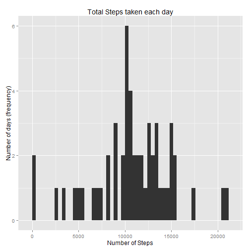
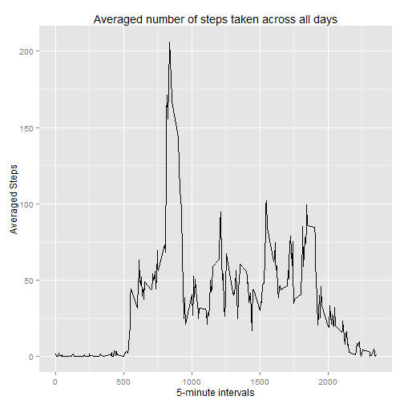
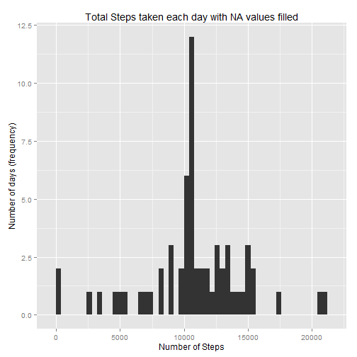
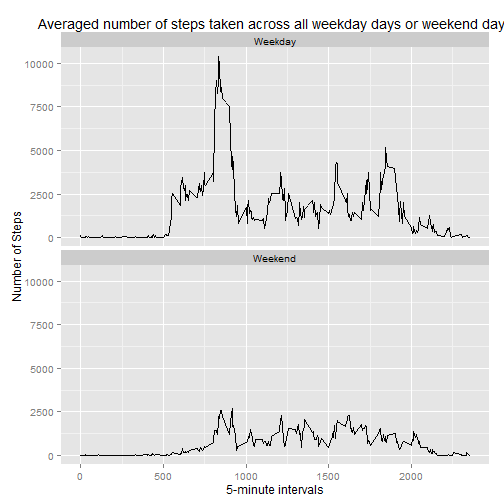

=====================================================================================================================

```r
library(dplyr)
library(ggplot2)
```
# Loading and preprocessing the data

I assume the input file is already in my directory

```r
initial_activity <- read.csv("./activity.csv")
```

=====================================================================================================================

# What is mean total number of steps taken per day?

## Calculate the total number of steps taken per day.

```r
totalstepsperday <- initial_activity %>% group_by(date) %>% summarise(TotalSteps = sum(steps))
```

## For this part of the assignment, you can ignore the missing values in the dataset.

```r
totalstepsperday <- subset(totalstepsperday, !is.na(TotalSteps))
```

## Make a histogram of the total number of steps taken each day.

```r
ggplot(totalstepsperday, aes(x=TotalSteps)) + geom_histogram(binwidth = 400) +
        labs(title = "Total Steps taken each day", x = "Number of Steps", y = "Number of days (frequency)")
```

 

## Calculate and report the mean and median of the total number of steps taken per day.

```r
mean_total <- mean(totalstepsperday$TotalSteps)
median_total <- median(totalstepsperday$TotalSteps)
```

The mean is 10766 and the median is 10765.

=====================================================================================================================

# What is the average daily activity pattern?

## Make a time series plot (i.e. type = "l") of the 5-minute interval (x-axis) and the average number of steps taken, averaged across all days (y-axis)

```r
averageinterval <- subset(initial_activity, !is.na(steps)) %>% group_by(interval) %>% summarise(AverageSteps = mean(steps))
ggplot(averageinterval, aes(x=interval, y=AverageSteps)) + geom_line() +
        labs(title = "Averaged number of steps taken across all days", x = "5-minute intervals", y = "Averaged Steps")
```

 

## Which 5-minute interval, on average across all the days in the dataset, contains the maximum number of steps?

```r
max_interval_steps <- averageinterval[which.max(averageinterval$AverageSteps),1]
max_steps <- max(averageinterval$AverageSteps)
```
The interval 835 contains the maximum number of steps: 206.1698113

=====================================================================================================================

# Imputing missing values

## Calculate and report the total number of missing values in the dataset (i.e. the total number of rows with NAs)

```r
number_of_missing <- sum(is.na(initial_activity$steps))
```
The total number of missing values in the dataset is: 2304

## Devise a strategy for filling in all of the missing values in the dataset.
## The strategy could use the mean/median for that day, or the mean for that 5-minute interval, etc.
Our strategy will reuse the values we calculated : average number of steps taken, averaged across all days

##Create a new dataset that is equal to the original dataset but with the missing data filled in.
We have 2355 intervals


```r
total_activity <- initial_activity
NA_Index <- which(is.na(initial_activity$steps))
for (index in 1:number_of_missing) {
        WichInterval <- initial_activity$interval[NA_Index[index]]
        new_value <- averageinterval$AverageSteps[averageinterval$interval == WichInterval]
        total_activity$steps[NA_Index[index]] <- new_value
}       
```

## Make a histogram of the total number of steps taken each day

```r
completetotalstepsperday <- total_activity %>% group_by(date) %>% summarise(TotalSteps = sum(steps))
ggplot(completetotalstepsperday, aes(x=TotalSteps)) + geom_histogram(binwidth = 400) +
        labs(title = "Total Steps taken each day with NA values filled", x = "Number of Steps", y = "Number of days (frequency)")
```

 

## Calculate and report the mean and median total number of steps taken per day.

```r
mean_total_filled <- mean(completetotalstepsperday$TotalSteps)
median_total_filled <- median(completetotalstepsperday$TotalSteps)
```

The new mean and median are 10766 and 10766.

It seems impact of imputing missing data on the estimates of the total daily number of steps is not big (or I missed something).

=====================================================================================================================

# Are there differences in activity patterns between weekdays and weekends?

## For this part the weekdays() function may be of some help here. Use the dataset with the filled-in missing values for this part.
## Create a new factor variable in the dataset with two levels - "weekday" and "weekend" indicating whether a given date is a weekday or weekend day.
oooops I realize I am in Paris, France Saturday=samedi and Sunday=dimanche :)

```r
total_activity$TypeofDay <- ifelse(weekdays(as.Date(total_activity$date)) %in% c("samedi","dimanche"), "Weekend","Weekday")
completetotalstepsperdayAndType <- total_activity %>% group_by(TypeofDay,interval) %>% summarise(TotalSteps = sum(steps))
```

## Make a panel plot containing a time series plot (i.e. type = "l") of the 5-minute interval (x-axis) 
## and the average number of steps taken, averaged across all weekday days or weekend days (y-axis).

```r
ggplot(completetotalstepsperdayAndType, aes(x=interval, y=TotalSteps)) +
        facet_wrap(~ TypeofDay, nrow=2, ncol=1) + geom_line() +
        labs(title = "Averaged number of steps taken across all weekday days or weekend days", x = "5-minute intervals", y = "Number of Steps")
```

 

figure directory produced with the command "knit2html("PA1_template.Rmd")"

and now I can go to bed finally...
